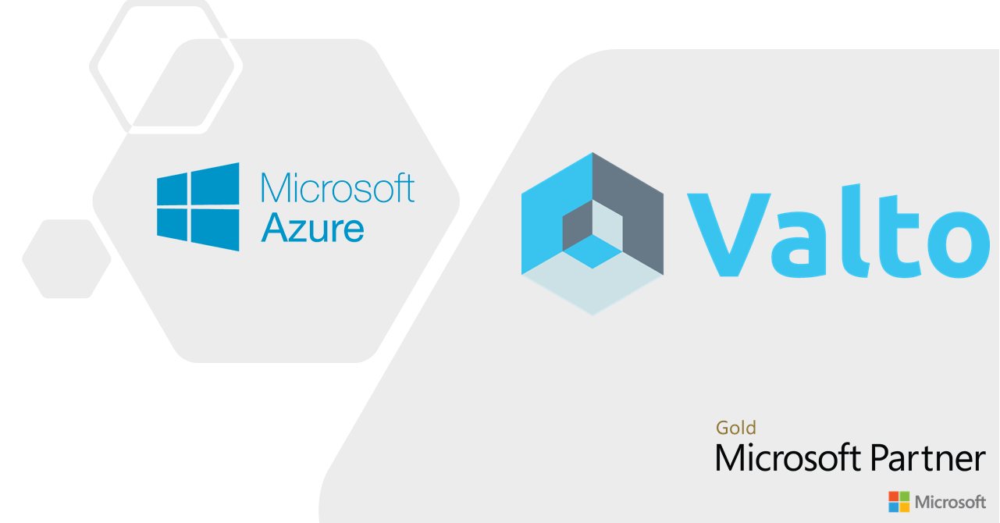

<!-- PROJECT LOGO -->
 

  

  <h2 align="left">Valto Azure Managed Services</h2>

### Pay as You Go Support
A range of token based agreements to suit your organisations budget. Call on our Azure Experts to provide ongoing support and consultancy when you need it.
### Ongoing Monthly Support
Our flexible monthly support agreements provide a fixed cost that can scale on your Azure Usage.
### Azure Rescue Support
Our Azure Consultancy can provide Emergency and Rescue cover for your Azure environment. Helping you gain control of a spiralling Azure project.

<h2 align="left">Getting Started</h2>
Azure Lighthouse enables cross- and multi-tenant management, allowing for higher automation, scalability, and enhanced governance across resources and tenants.
With Azure Lighthouse, service providers can deliver managed services using comprehensive and robust management tooling built into the Azure platform. Customers maintain control over who can access their tenant, what resources they can access, and what actions can be taken. 
<h3 align="left">Delegate resources</h3>
This deployment will allow delagated access to the customers subscriptions to provide our CSP support offering. The following roles are enabled on the customer's subscription:
+ Reader
+ Contributor
<h3 align="left">Viewing Service Providers</h3>
Customers can use the Service providers page in the Azure portal to view details about service providers with delegated access.
To access the Service providers page in the Azure portal, the customer can select All services, then search for Service providers and select it. They can also find it by entering "Service providers" or "Azure Lighthouse" in the search box near the top of the Azure portal.
 
 

<!-- PROJECT END -->
